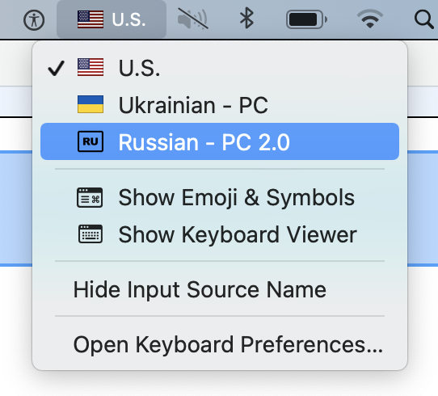

# It's a copy of the macOS keyboard layout "Russian - PC", but with the "RU" sign instead of russian flag.



## How to install

1. Download file ["Russian-PC-without-flag.zip"](./Russian-PC-without-flag.zip)
2. Unzip it
3. Copy bulde file to `~/Library/Keyboard\ Layouts` for local user or to `/Library/Keyboard Layout` for all users

```sh 
# local user
cp -r ./Russian-PC-without-flag.bundle ~/Library/Keyboard\ Layouts

# all users
cp -r ./Russian-PC-without-flag.bundle /Library/Keyboard\ Layouts
```

4. (Optional) Restart or re-login
5. Open **System Preferences -> Keyboard -> "+" -> Other -> Russian - PC 2.0** (without the flag)
6. Press "Add"

--------

# Это копия macOS клавиатуры "Russian - PC", которая используем знак "RU" вместо флага россии.

## Как установить

1. Скачайте файл ["Russian-PC-without-flag.zip"](./Russian-PC-without-flag.zip)
2. Распакуйте его
3. Скопируйте бандл в `~/Library/Keyboard\ Layouts` для вашего пользователя или в `/Library/Keyboard Layout` для всех пользователей

```sh 
# local user
cp -r ./Russian-PC-without-flag.bundle ~/Library/Keyboard\ Layouts

# all users
cp -r ./Russian-PC-without-flag.bundle /Library/Keyboard\ Layouts
```
4. Откройте **System Preferences -> Keyboard -> "+" -> Other -> Russian - PC 2.0** (без флага)
5. Нажмите Add

## How it was developed 

It's just a copy that was made by Ukelele according to this [tutorial](https://suragch.medium.com/how-to-make-a-custom-keyboard-for-mac-os-c9f607428372)